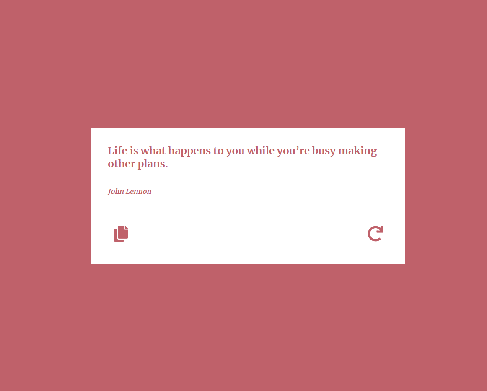

# How to run this proyect

First clone the repository form GitHub:
```
git clone https://github.com/JoseLuria/random-quotes-generator.git
```

Then install the dependencies:
```
npm install
```

Finally, start the server with the following command:
```
npm start
```
## ScreenShots


## Built with
- React
- Styled Components
- React Div 100vh (To fix the 100vh mobile Screen Bug)
- React Copy to clipboard
- React Hot Toast (For notifications)
